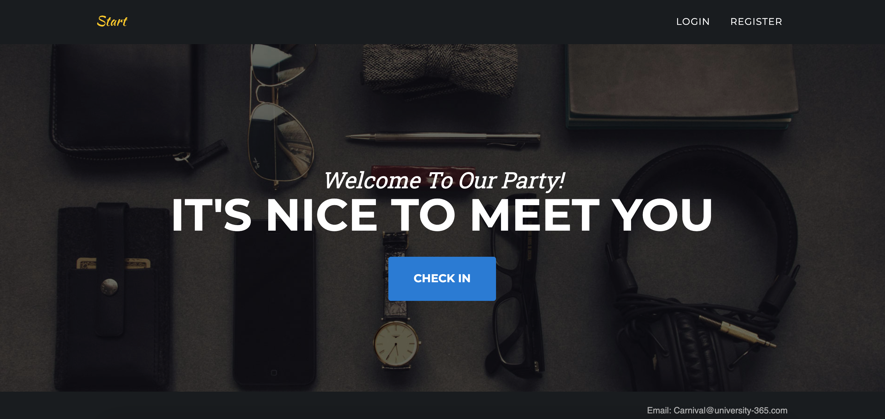
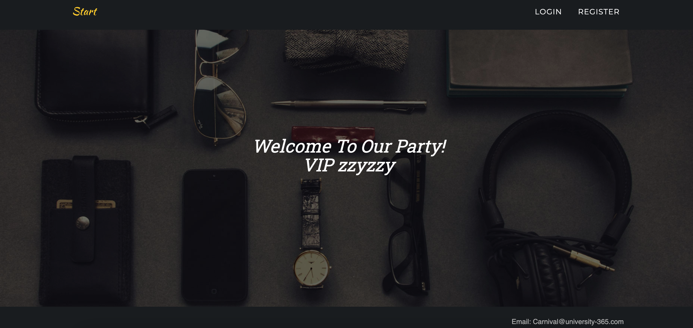
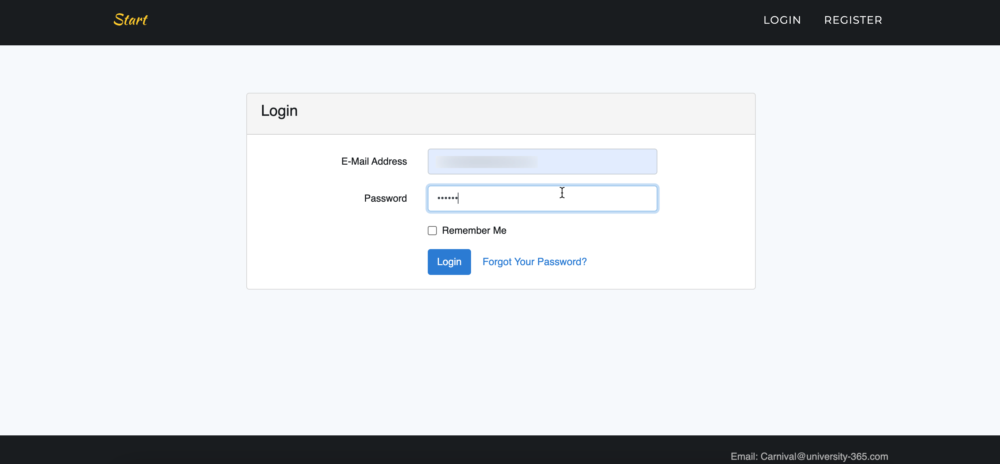
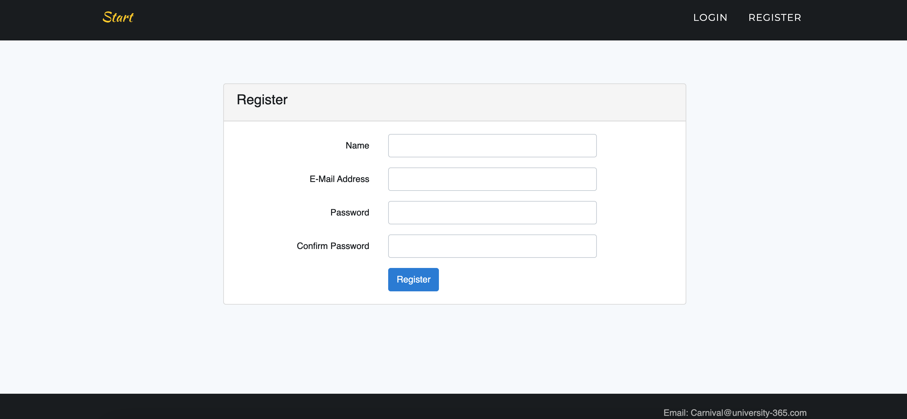
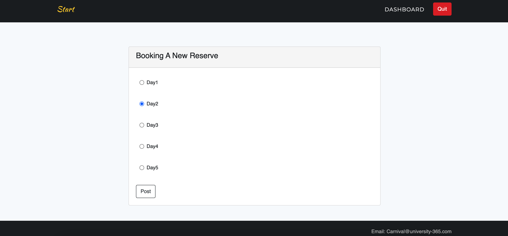
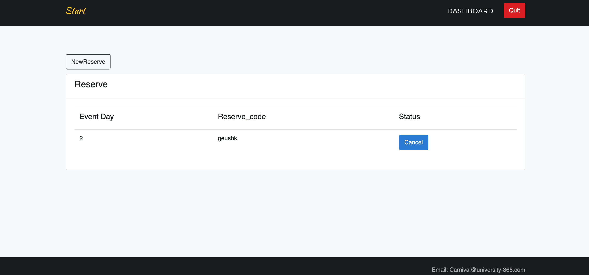
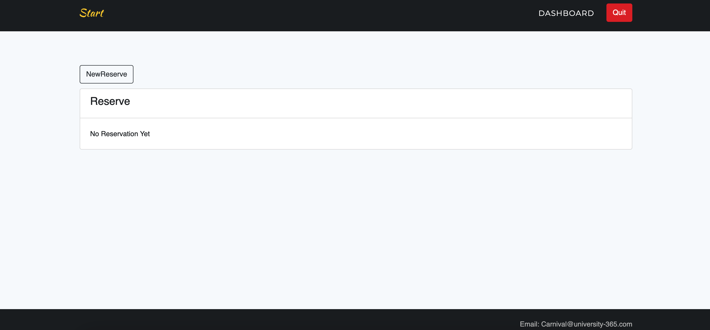

#### Scenario - The Carnival Booking System

For celebrating the new year, we are holding a **5-days long Carnival**. Required by the sponsor of the carnival, we need to implement a “Carnival Booking System” , which will manage users’ registration, reservation and on- site checking-in of the Carnival. This system will allow people to register a user in it, when the user log in, he/she would be able to reserve a ticket for him(or her)-self. When the user arrives to the party place, he/she would be able to “check-in” offering his/her invitation code and corresponding password.

My Work:  

II. Specification

**1. The “Main Module“**

1.1 The “Main Page” Module

1.2 The “Check in Page” Module

**2. The “Reservation Module“**

2.1. The “Login” Module

2.2. The “Dashboard” Page

2.3. The “New Reservation” Page

